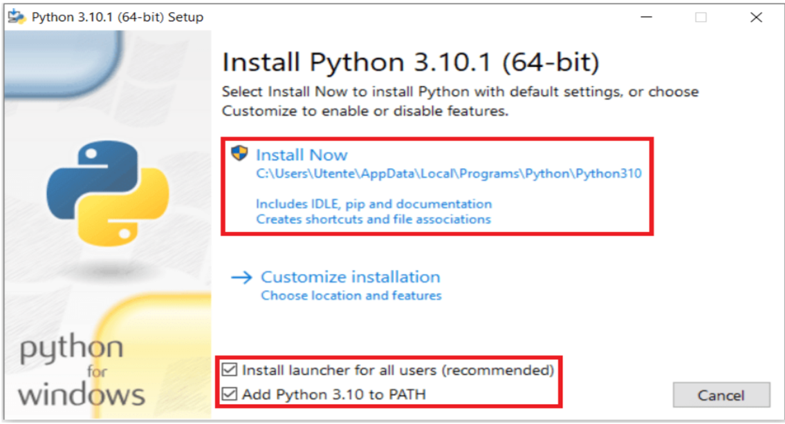

# Autolume-Live

Autolume-Live is a tool for real-time visual performances using StyleGAN2.
For a detailed Documentation and Demos look at the [Metacreation Website](https://www.metacreation.net/autolume)

## Getting started
### Windows Autolume Installer Guide

To successfully run this program, your system must have a 64-bit Windows operating system, and you must download and install the following prerequisites:

1. **[Autolume Installer](sinstaller.ps1)**
2. **[Cuda-Toolkit](https://developer.nvidia.com/cuda-11-7-0-download-archive)**
3. **[Python 3.10](https://www.python.org/downloads/release/python-3100/)** (scroll down to files and select a compatible version to your system)

*While installing Python, make sure to select "Add Python to PATH" as shown below:*



## Installation Steps

1. Open Command Prompt (`windows+R` > `cmd`)
2. Run the following command: `where python`
   - If more than one copy of Python 3.10 is found, Ctrl+C the result. It should look like this:
     ```
     C:\Path\To\Python310\
     ```

3. Click on `sinstaller.ps1` file and open it (located in your Downloads folder).
4. Paste the outcome of step 2 to the `systemPython` variable under `#Define python path` in the script:
   ```powershell
   $systemPython = "C:\Path\To\Python310\"

Steps to add ffmpeg:
Download the ffmpeg from here.
Extract the downloaded file.
Rename the extracted folder to ffmpeg.
Type system variables into the search bar and click the Edit the system environment variables option.
Under the User variables section, select Path and click the Edit button.
Choose New from the side menu.
Add C:\ffmpeg\bin to the empty field and confirm changes with OK.
To verify the FFmpeg is correctly added to the Windows PATH, open the Command Prompt or PowerShell and run: ffmpeg
 The output confirms the installation: 
             
Go to Downloads and type PowerShell in the address bar and hit Enter.
Run the following command inside PowerShell: .\sinstaller.ps1   
Next time you want to run Autolume, simply click the AutolumeLiveColab shortcut on your Desktop.


Place your StyleGAN2 checkpoints (https://github.com/NVlabs/stylegan2-ada-pytorch) in the `models` folder.
Click the AutolumeLiveColab desktop shortcut and get going!

## Examples

Showcase of current state: https://www.dropbox.com/s/e8yfdtdw3x3s7h0/autolume.mp4?dl=0 \
Trial runs:\
    https://www.instagram.com/p/ChsrxkCjJNu/ \
    https://www.instagram.com/p/Cg5aMrqjgIM/ \
Installations: \
    https://metacreation.net/autolume-mzton/ \
    https://metacreation.net/autolume-acedia/ 

## In Progress
- Make start screenlook nicer
- Training, Compressing, GANspace stop interface and can only be stopped by stopping program
- Sometimes pytorch slows down (seems to aggregate variables in the background), when clearing with gc.collect overall slowdown in render and gui but more stable (currently commented out)
- Super resolution: Off-line super-res module via Real-ESRGAN is now added to GUI and wait for testing. An upgrade model of RRDB net can be implemented for best frame quality. Choices of model is yet to be added for the user to choose different super-res style (photo-realistic or anime-artisitc)


## Acknowledgment
PyTorch StyleGAN2-ada: https://github.com/NVlabs/stylegan2-ada-pytorch \
Underlying GUI code: https://github.com/NVlabs/stylegan3 \
GAN compression: https://github.com/lychenyoko/content-aware-gan-compression \
GANSpace: https://github.com/harskish/ganspace

## License
Some of the dependencies fall under the [Nvidia Source Code License](https://github.com/NVlabs/stylegan3/blob/main/LICENSE.txt).


## Project status
This code base is still open to changes and bugs might still appear. Please create issues and let us know so we can polish for the final release!
